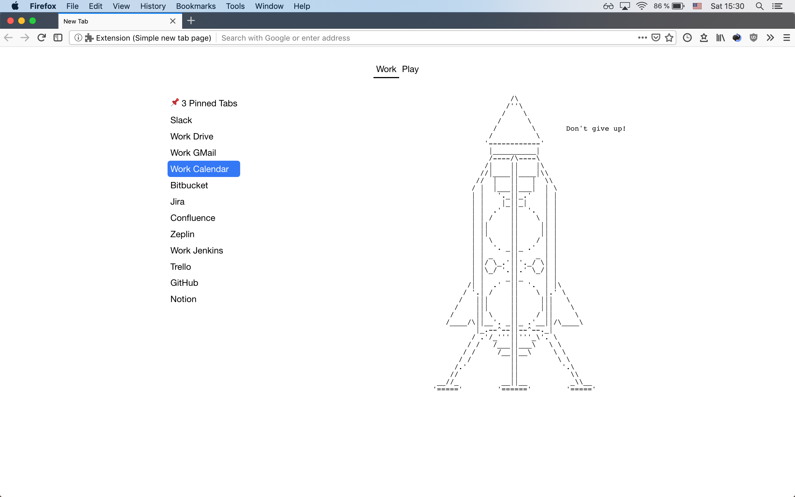

# newtab

A new tab page

## About

This extension will display bookmarks and a simple notepad on a web-extension compatible browsers new tab page.

I built this for my specific use case of showing different bookmarks based on switchable contexts (work & play).

To add bookmarks to show in the work context, add them to a folder called `__work__bookmarks`, to show them in the play context, add them to a folder called `__play__bookmarks`.

Current context and notepad contents are persisted in localstorage.

## Install

	$ npm install

## Development

    npm run dev chrome
    npm run dev firefox
    npm run dev opera
    npm run dev edge

## Build

    npm run build chrome
    npm run build firefox
    npm run build opera
    npm run build edge

## Environment

The build tool also defines a variable named `process.env.NODE_ENV` in your scripts. 
